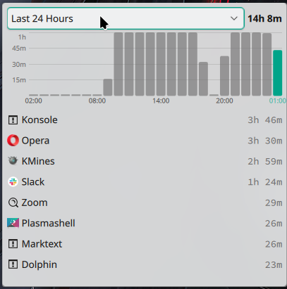
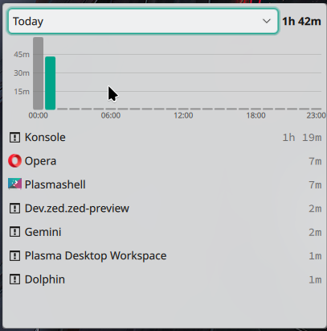
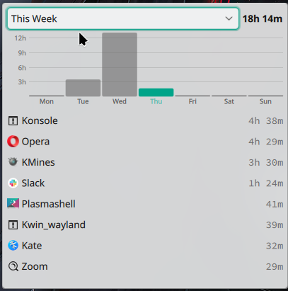

# Screen Time

A privacy-first KDE Plasma 6 widget that tracks how much time you spend in each application — no cloud, no telemetry, everything stays on your machine.

## Screenshots

| Last 24 Hours | Today | This Week |
|---|---|---|
|  |  |  |

## Features

- Per-app usage breakdown with icons
- Bar chart with Y-axis time markers
- Five time filters: Last 24 Hours, Today, This Week, This Month, Last 3 Months
- Resizable desktop widget — shows more apps as you make it taller
- Data stored locally in SQLite, purged after 3 months
- Wayland native (X11 fallback supported)

## Prerequisites

- KDE Plasma 6
- `go` 1.22+ (only needed at install time)
- `qdbus6` — usually ships with KDE (`qdbus-qt6` on openSUSE)
- `plasma5support6` — KDE QML module (`plasma5support6` on openSUSE)

## Install

```bash
git clone git@github.com:kathbigra/screen-time-kde-plasma-widget.git
cd screen-time-kde-plasma-widget
bash install/install.sh
```

Then right-click your desktop → **Add Widgets** → search for **Screen Time**.

## Uninstall

```bash
systemctl --user disable --now screen-time
rm ~/.local/bin/screen-time
rm ~/.config/systemd/user/screen-time.service
rm -rf ~/.local/share/plasma/plasmoids/com.github.kathbigra.activitymonitor
rm -rf ~/.local/share/icons/hicolor/256x256/apps/com.github.kathbigra.activitymonitor.png
rm -rf ~/.local/share/screen-time   # removes all stored data
```

## License

Source-available. You may read and study this code. You may not copy, reproduce, or reuse it in your own projects without explicit written permission. See [LICENSE](LICENSE) for full terms.
